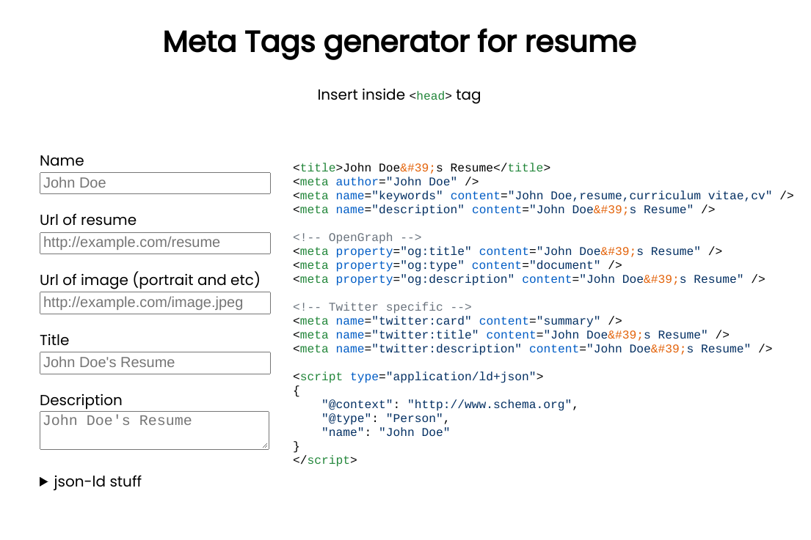

# Meta tags generator for resume

## To use open: https://meta-gen.izzqz.me/

## About

This tool helps you to generate metatags and metadata specialy for your web resume or CV.
Any PR and issue wellcome.
## How to use

Input your value, select and copy, incert inside `<head>` tag.
Feel free to modify.

## How to test this output.

Simply you can use [Schema Markup Validator](https://validator.schema.org/). And [socialsharepreview](https://socialsharepreview.com/) as well.

